# 말랑하조 2조

[TOC]

## 진행상황

- 아이디어 구체화
- 기획서 작성
- 기능 구체화 작성
- 기능 명세서 작성
- 와이어 프레임 작업중

# 기획서

## 프로젝트 개요

### 문제 정의 

<aside> 💬 코로나19로 인한 비대면 수업, 모바일 기기의 사용량 증가 및 독서량 감소에 따른 문해력 저하 
</aside>

### 개발 동기

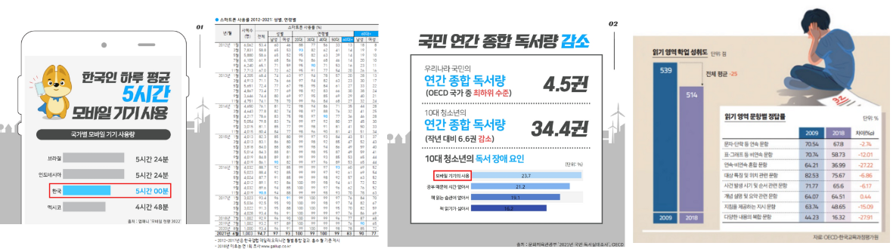

- 코로나19로 인한 비대면 수업 증가
  - 전체 교과의 ‘보통학력 이상’ 비율 감소
  - 국어의 경우 감소세가 가파른 편
  - ‘기초학력 미달’ 비율도 코로나 이전에 비해 크게 증가
- 모바일 기기의 사용량 증가
- 영상 매체 선호
  - 짧은 영상 매채 (Yotube Shorts,  TikTok)
- 줄어든 독서량
- 장문 기피 현상
  - 영상 매체를 통한 요약본 선호
  - 세줄 요약

### 페르소나

- 모바일 기기에 익숙한 중학생 2학년 김ㅇㅇ
  - 나이: 15세
  - 직업: 학생
  - 취미: 틱톡 챌린지(거울 닦기 챌린지 view 3천), 유튜브 쇼츠 올리기
  - 성격
    - ENFJ
  - 상황
    - 부모님 모두 맞벌이로, 비대면 기간동안 학습 관리를 받지 못함
    - 책을 읽기 싫어하여 초등학교 이후 독서량 없음
    - 교과서에 나오는 어려운 단어의 뜻을 정확히 모르고 넘어가는 경우가 잦음

### 차별성

- 국어국어원 한국어교수학습샘터
  - 한국어 교원의 자질 향상을 위한 웹 서비스
  - 교원을 위한 서비스이다 보니 일반인이 이용하기 쉽지 않음
  - 한국인을 위한 서비스는 다소 부족
  - 게이미피케이션 요소가 없어 교원이 아니면 꾸준히 이용할 유인 부족
- KOKOA - TOPIK & KOREA
  - 한국어로 말하기, 듣기, 읽기, 쓰기에 과정이 있는 모바일 서비스
  - 또한 한국인이 대상이 아닌 한국어 학습을 원하는 외국인이 대상
  - 240개로 적은 데이터

### 기대효과

- 많은 단어를 알게되고, 정확한 뜻을 학습하여 문해력 저하 및 정보 판단 능력 저하를 극복
- 게이미피케이션(등급, 호칭, 도감)을 통한 자발적 학습 의욕 증진

## 프로젝트 세부 사항

### 프로젝트명

- 홍민정음

### 주제

- 문해력 향상을 위한 단어 및 문맥 학습 서비스

### 주 연령층

- 학생 및 성인

### 서비스 특징

- 인공지능 음성 기능(TTS, SST)을 활용한 우리말 학습 플랫폼
- 단어 학습을 통한 문해력 향상
- 반응형 웹을 통한 시간과 장소에 구애받지 않는 서비스
- 게이미피케이션을 통한 재미있는 학습 환경 제공

### 주요 기능

- 단어, 문맥 학습을 음성(STT) 또는 타이핑을 통해 학습
- 학습을 통해 맞추거나 틀린 단어를 TTS를 통해 듣기
- 오답노트를 활용한 복습 기능
- 문맥 도감을 통한 단어  카드 수집 기능
- 오늘의 추천 단어 : 뉴스 키워드 추출 후 형태소 분석
- 매달 마지막 주 주말(토,일) 과거 시험을 통해 메인페이지 랭킹 등록
- 참여도를 게임화 시킨(칭호, 등급) 기능 제공

------

# 기능 구체화

## 1. 학습

### 학습1. 단어 학습

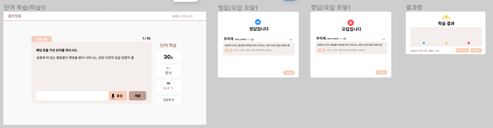

- 단어의 의미를 보여주고 알맞은 단어 찾기
- 말, 타자로 답안 작성
- 문제 10개씩 구성 (o3 Δ4 x3)
  - 맞은거, 틀린거만 DB에 표시
  - 세모는 그냥 지나감
  - 오답공책에서 두 개 가져와서 사용
- 문제 1개 당 30초로 구성
- 15초 후 초성 힌트 제공
- 건너뛰기, 그만하기 버튼으로 학습 끝낼 수 있음
- 결과창 : O, Δ, X 로 보여주고 DB에 Δ 카운팅
- 한 세트(5문제) 끝나고 DB에 요청
- 한 문제당 30 exp

### 학습2. 문맥 학습 (문맥 도감)

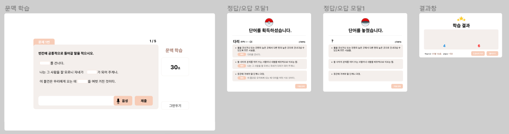

- 의미가 다른 다의어가 포함되는 문장 3개 제시
- 동시에 들어갈 단어를 선택하는 방식
- 문제 5개 1세트
- 문제 1개 당 30초로 구성
- 틀렸을 경우 단어는 알려주지 않고 뜻3개만 제시
- 건너뛰기, 그만하기 버튼으로 학습 끝낼 수 있음
- 맞은 문제는 문맥 도감에서 획득
- DB에 단어 + 뜻 3개 + 문장 3개로 구성되어 있음
- 한 세트(5문제) 끝나고 DB에 요청

### 학습3. 과거시험

- 마지막 주 주말마다 과거시험 진행
- MAIN 페이지에서 과거시험 클릭 시 시험쳤는지 확인
- 확인 후 응시를 안했으면 “시작하기" 버튼, 이미 응시를 했으면 “응시불가” 버튼
- 시작하기 버튼을 누르면 -10점을 보내 중간에 나가더라도 응시를 불가하도록 막음.
- 과거시험 10문제
  - 오지선다
  - 한문제당 30초
- 결과 페이지에서 경험치( 1000 생각중 )와 점수(한 문제당 10점)를 보여줌
- 다 맞힌 사람 ⇒ 장원급제 ⇒ 칭호(뱃지) 획득
- 시험이 끝나면 (시험기간이 끝) MAIN페이지와 공지사항에서 장원급제한 사람 볼 수 있음.
- MAIN 페이지에서 시험 공고와 시험 결과 공고를 띄어줌. ( 7일 동안 안뜨게 가능 )

## 2. 문맥 도감 ( 100개 )

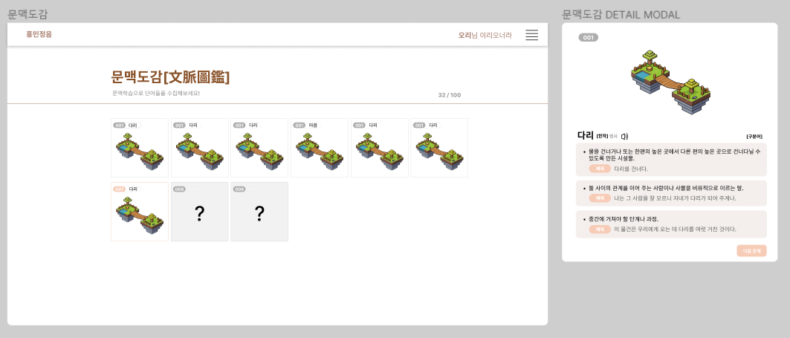

- 매일 무제한 획득 가능
- 레어카드 6장 (권민:은색, 은진:금색, 애림:핑크색, 남규:짙은파랑색, 홍민:보라색, 찬희:초록색)
- 매번 랜덤 5문제 출제

## 3. 오늘의 추천 단어

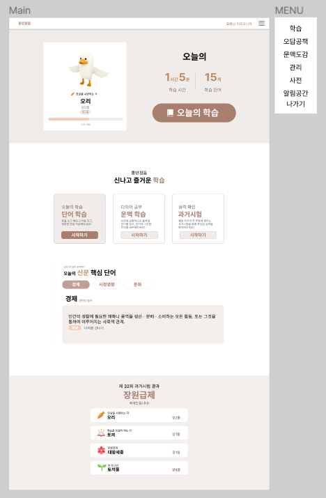

- 뉴스 크롤링으로 키워드 추출
- 단어, 뜻 제공

## 4. 사전

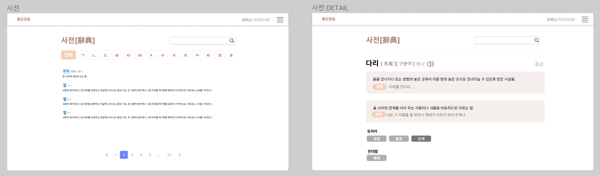

- 읽어주기
- 검색 가능

## 5. 오답공책

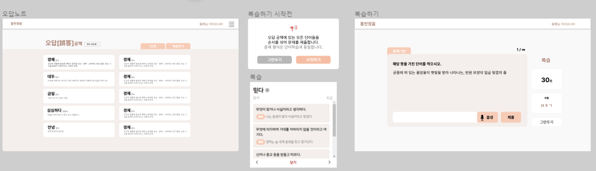

**단어 구분** : 정답⭕/오답 ❌

완전히 틀린 X만 오답노트로 저장

### 연습

- ✔ 버튼 누르면 학습1이 실행됨
- 오답노트안의 모든 단어에서 랜덤으로 추출되며, [중단하기] 버튼을 누르면 끝남

### 복습 (단어 detail 카드)

- 단어를 누르면 넘기는 카드형식으로 보여주고 카드 넘어갈때 자동으로 읽어줌
- detail card는 자동 플레이 기능 없음
- 따로 detail card만 보는 시작버튼 없음

## 6. 사용자

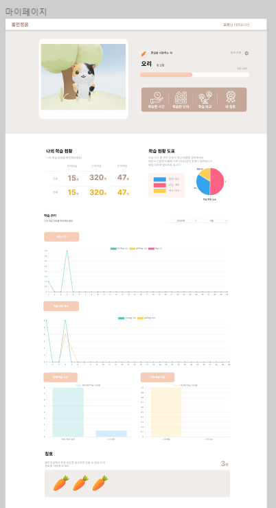

### 등급[정9] / 경험치

- 정_품으로 9단계로 구성 (종_품 제외)
- 등급이 올라가기 위한 경험치 2배씩 커짐 100 200 400 800 1600 … 25600
- 맞춘 문제 한 문제당 경험치 10exp (복습하기에서는 X)

### 칭호(뱃지)

: 획득한 것만 보여주기 [ 그림, 날짜, 이름, 방법, 장착하기 버튼 ]

- 과거 시험

  3단계로 구성

  매달 마지막주 주말 (이틀간)

  단계 당 10문제 [문제는 만들예정]

  - 성균관 유생, 장원급제 등으로 칭호 줌

- 출석

  - 첫 로그인시 새싹🌱
  - 10, 30, 90, 365일 누적
  - 10, 30, 90, 365일 연속

- 학습시간

  - 10, 24, 72, 360시간

- 도감

  - 100개 다 모으기
  - 레어카드 다 모으기

- 이스터에그

  - 한글날 접속 시 ‘한글을 사랑하는 자’
  - 세종대왕님 생신 5/15 ‘세종대왕을 사랑하는 자’
  - 특정 상호작용 시 얻을 수 있는 칭호 존재(캐릭터 100번 클릭 - 말랑말랑)
  - 발표날 접속자 ‘발 빠른 사람’

### 학습시간

- 오늘 학습시간 / 총 학습시간
- 어제보다 얼마나 했는지 ( 마이페이지 들어갔을때만 ) 

### 단어 정복

- 오늘 학습한 갯수 / 내가 이때까지 학습한 갯수

### 학습 달력 ( 이번주 )

학습시간, 학습 단어개수 일주일치 그래프로 보여주기

### 회원가입

- 별명 (닉네임)
- 계정명 (아이디)
- 비밀번호
- 휴대전화인증 필요

---

# 기능 명세서

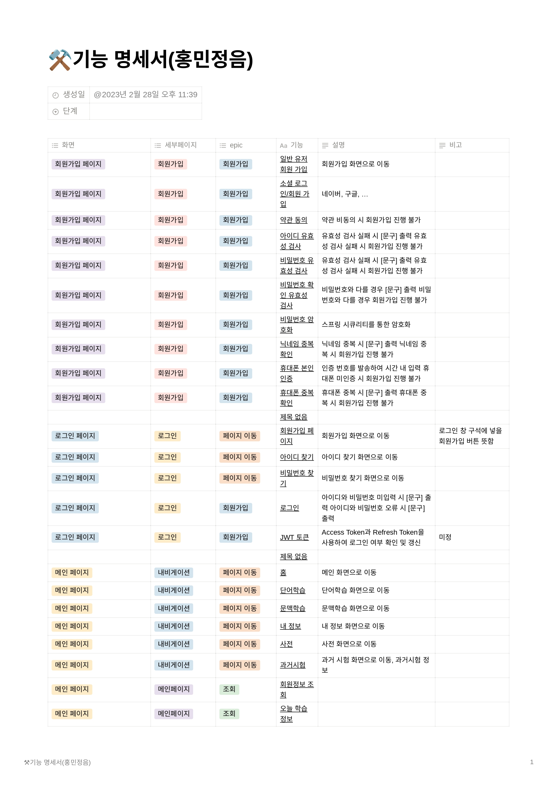

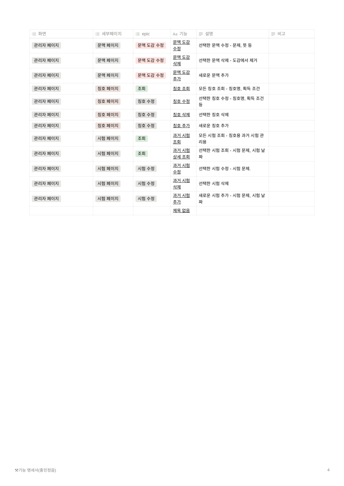

# API 명세서

# ERD

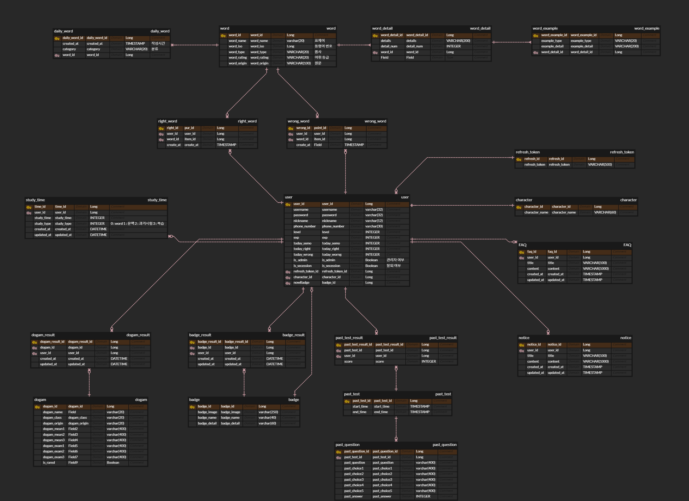

# 시퀀스 다이어그램

# 아키텍처

