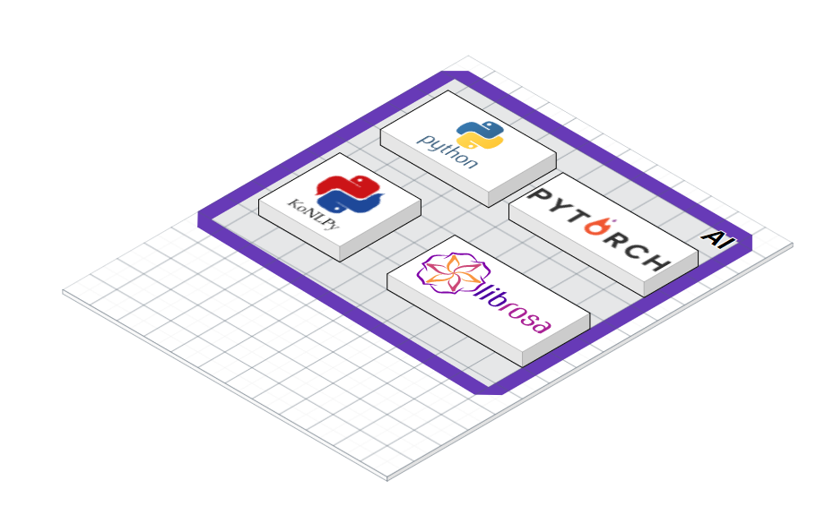

# 📚포팅 메뉴얼

## 📑목차

### [1. 기술 스택 & 버전 정보](#기술-스택-버전-정보)

### [2. 빌드 방법](#빌드-방법)

### [3. Docker & Jenkins](#docker-jenkins)

### [4. 기타 설정](#기타-설정)

---

## 🛠기술 스택 & 버전 정보

### 1. 이슈관리


</br>

### 2. 형상관리


</br>

### 3. 커뮤니케이션

 

</br>

### 4. 개발 환경

#### **IDE**


#### **DB**


#### **UI/UX**


#### **Server**


</br>

### 5. 상세

#### **Backend**


#### **Frontend**


#### **AI**


#### **CI/CD**


---
## ⚙빌드 방법

### ◼BE

1. **`back-server`** 프로젝트 열기
2. JDK 1.8 버전 확인
3. src/main/BackApplication class 실행

### ◻FE

1. **`front-server`** 로 이동
2. npm install
3. npm install react-wordcloud --save --legacy-peer-deps (react-wordcloud 오류로 인해 따로 설치)
4. npm start

### ◼AI

1. **`python-server/tts_api`** 로 이동
2. pip install -r requirements.txt
3. python flask_tts.py

---

 ## 🌞Docker & Jenkins




### 1. 서버 접속
```bash
# Window Terminal 사용
## - Naver Cloud 서버 : Front, Back 서버 ( 사용자 계정 생성 후 사용 )
## - ssafy 제공 서버 : AI 서버 ( pem 키 사용 )
ssh [사용자-계정-아이디]@[탄련적IP/도메인 주소] => 비밀번호 입력 후 접속
ssh -i [키명.pem] ubuntu@[탄련적IP/도메인 주소]
```

### 2. 기본 설정
```bash
# 방화벽 설정
sudo ufw allow 22 # ssh
sudo ufw allow 80 # http 
sudo ufw allow 443 # ssl
sudo ufw allow [8080/5000/9090/...] # 필요한 포트 번호 개방
sudo ufw enable
# 상태 확인
sudo ufw status
```
### 3. Docker 설치
```bash
# 사전 패키지 설치
sudo apt update
sudo apt-get install -y ca-certificates \
    curl \
    software-properties-common \
    apt-transport-https \
    gnupg \
    lsb-release

# gpg 키 다운로드 : 프로그램 패키지가 유효한지 확인하기 위해 gpg키를 통해 검증
sudo mkdir -p /etc/apt/keyrings
curl -fsSL https://download.docker.com/linux/ubuntu/gpg | sudo gpg --dearmor -o /etc/apt/keyrings/docker.gpg

echo \
    "deb [arch=$(dpkg --print-architecture) signed-by=/etc/apt/keyrings/docker.gpg] https://download.docker.com/linux/ubuntu \
    $(lsb_release -cs) stable" | sudo tee /etc/apt/sources.list.d/docker.list > /dev/null

# Docker 설치
sudo apt update
sudo apt install docker-ce docker-ce-cli containerd.io docker-compose
```

### 4. 젠킨스 설치
#### 젠킨스 설치
- docker-copmpose.yml 생성 : vim 이용
```yml
version: '3'

services:
    jenkins:
        image: jenkins/jenkins:lts
        container_name: jenkins
        volumes:
            - /usr/bin/docker:/usr/bin/docker
            - /var/run/docker.sock:/var/run/docker.sock
            - /jenkins:/var/jenkins_home
            - /home/[사용자-계정]/certbot:/var/certbot
        ports:
            - "9090:8080"
        privileged: true
        user: root
    redis:
        image: redis:latest
        container_name: redis
        command: redis-server --port 6379
        hostname: redis
        ports:
            - 6379:6379
```
```bash
# ssl 설정
cd
sudo mkdir certbot
cd certbot
sudo mkdir conf www logs
sudo docker pull certbot/certbot
# certbot을 실행하기 위해서는 80 포트를 사용해야한다.
# 따라서, 80 포트를 다른 서비스에 사용해야한다면 먼저 certbot을 실행한 후 사용해야한다.
sudo docker run -it --rm --name certbot -p 80:80 -v "/home/ubuntu/certbot/conf:/etc/letsencrypt" -v "/home/ubuntu/certbot/log:/var/log/letsencrypt" -v "/home/ubuntu/certbot/www:/var/www/certbot" certbot/certbot certonly

# 컨테이너 생성
sudo docker-compose up -d

# 컨테이너 확인
sudo docker ps
```
#### 젠킨스 설정
```bash
# 젠킨스 Administrator password 확인
sudo docker logs jenkins

1. 서버 공인 IP:9090 => 젠킨스 접속
2. 관리자 접속([docker logs jenkins]로 패스워드 확인)
3. 기본 플러그인 자동 설치
4. 젠킨스 계정 생성
5. Jenkins 관리 -> 플러그인 관리 -> 설치 가능
6. gitlab 플러그인 설치 : GitLab, Generic Webhook Trigger, Gitlab API, GitLab Authentication
7. docker 플러그인 설치 : Docker, Docker Commons, Docker Pipeline, Docker API
8. SSH 플러그인 설치 : Publish OPver SSH
```
### 5. NGINX 설정
#### Front, Back Server Nginx Confing
```bash
#######################################
# Frontend, Backend Server Config
map $http_upgrade $connection_upgrade {
    default upgrade;
    ''      close;
}

server {
    listen       80;
    # listen  [::]:80;
    server_name  [공인 IP];

    location / {
        return 301 https://$host$request_uri;
    }
}
server{
    listen 443 ssl;
    # listen [::]:443;

    server_name [공인 IP];
    
    access_log  /var/log/nginx/access.log;
    error_log  /var/log/nginx/error.log;

    ssl_certificate /etc/letsencrypt/live/[도메인 주소]/fullchain.pem;
    ssl_certificate_key /etc/letsencrypt/live/[도메인 주소]/privkey.pem;
    ssl_protocols TLSv1 TLSv1.1 TLSv1.2 SSLv3;
    ssl_ciphers ALL;


    location / {
        root /usr/share/nginx/html;
        index index.html index.htm;
        try_files $uri $uri/ /index.html;
    }

	location /api {
        proxy_pass http://[공인 IP]:[포트번호];
        proxy_redirect off;
        proxy_set_header X-Real-IP $remote_addr;
        proxy_set_header X-Forwarded-For $proxy_add_x_forwarded_for;
    }

    error_page   500 502 503 504  /50x.html;
    location = /50x.html {
        root   /usr/share/nginx/html;
    }
}
```

#### AI(TTS) Server Nginx Confing
```bash
#######################################
# AI Server Config
map $http_upgrade $connection_upgrade {
  default upgrade;
  ''      close;
}

server {
    listen       80;
    listen  [::]:80;
    server_name  [공인 IP];


    location / {
        return 301 https://$host$request_uri;
    }
}

server{
    listen 443 ssl;
    listen [::]:443;

    server_name [공인 IP];
    
    access_log  /var/log/nginx/access.log;
    error_log  /var/log/nginx/error.log;

    ssl_certificate /etc/letsencrypt/live/[도메인 주소]/fullchain.pem;
    ssl_certificate_key /etc/letsencrypt/live/[도메인 주소]/privkey.pem;
    ssl_protocols TLSv1 TLSv1.1 TLSv1.2 SSLv3;
    ssl_ciphers ALL;

    location / {
        proxy_pass http://[공인 IP]:[포트번호];
        
        proxy_redirect off;
        proxy_set_header X-Real-IP $remote_addr;
        proxy_set_header X-Forwarded-For $proxy_add_x_forwarded_for;
    }

    error_page   500 502 503 504  /50x.html;
    location = /50x.html {
        root   /usr/share/nginx/html;
    }
}
```

### 6. DockerFile 생성
> Naver Cloud Server
#### Back-End
```Dockerfile
# **/back-server/DockerFile
FROM adoptopenjdk/openjdk11 AS builder

COPY gradlew .
COPY gradle gradle
COPY build.gradle .
COPY settings.gradle .
COPY src src
RUN chmod +x ./gradlew
RUN ./gradlew bootJAR

FROM adoptopenjdk/openjdk11
COPY --from=builder build/libs/*.jar app.jar
EXPOSE 8080 
ENTRYPOINT ["java", "-jar", "/app.jar"]

```
#### Front-End
```Dockerfile
# **/front-server/DockerFile
FROM node:18.12.1 as build-stage
WORKDIR /var/jenkins_home/workspace/hmje-deploy/front-server
COPY package*.json ./
RUN npm install
RUN npm install react-wordcloud --save --legacy-peer-deps
COPY . .
RUN npm run build
FROM nginx:stable-alpine as production-stage

COPY --from=build-stage /var/jenkins_home/workspace/hmje-deploy/front-server/build /usr/share/nginx/html
COPY --from=build-stage /var/jenkins_home/workspace/hmje-deploy/front-server/deploy-conf/nginx.conf /etc/nginx/conf.d/default.conf
EXPOSE 80
CMD ["nginx", "-g","daemon off;"]

```
#### 오늘의 추천 단어
```Dockerfile
# **/python-server/news_word/DockerFile
FROM ubuntu:18.04
WORKDIR /var/jenkins_home/workspace/hmje-deploy/python-server/news_word

# 모든 파일.
COPY * ./

# timezone
ENV TZ=Asia/Seoul
RUN ln -snf /usr/share/zoneinfo/$TZ /etc/localtime && echo $TZ > /etc/timezone

# python, jdk
RUN apt-get update
RUN apt-get install software-properties-common -y
RUN add-apt-repository ppa:webupd8team/java
RUN add-apt-repository ppa:deadsnakes/ppa
RUN apt-get update
RUN apt-get install python3.10 -y
RUN apt-get install g++ openjdk-8-jdk curl -y
RUN curl -sS https://bootstrap.pypa.io/get-pip.py | python3.10
RUN python3.10 -m pip install --upgrade pip --user
RUN python3.10 -m pip install konlpy
RUN python3.10 -m pip install -r requirements.txt

# Add the script to the Docker Image
ADD news_word.sh /root/news_word.sh
ADD 2016-10-20.txt /root/2016-10-20.txt

# Give execution rights on the cron scripts
RUN chmod 0644 /root/news_word.sh
RUN chmod 0644 /root/2016-10-20.txt

# cron
RUN apt-get update
RUN apt-get -y install cron

# Add the cron job
RUN crontab -l | { cat; echo "0 12 * * * bash /root/news_word.sh"; } | crontab -
RUN crontab -l | { cat; echo "0 0 * * * bash /root/news_word.sh"; } | crontab -

CMD ["cron", "-f"]
```
> AWS Server
#### AI(TTS)
```Dockerfile
# **/python-server/tts_api/DockerFile
FROM ubuntu:18.04
WORKDIR /var/jenkins_home/workspace/hmje-deploy/python-server/tts_api

# 모든 파일.
COPY * /root/

# timezone
ENV TZ=Asia/Seoul
RUN ln -snf /usr/share/zoneinfo/$TZ /etc/localtime && echo $TZ > /etc/timezone

# python, jdk
RUN apt-get update
RUN apt-get install software-properties-common -y
RUN add-apt-repository ppa:webupd8team/java
RUN add-apt-repository ppa:deadsnakes/ppa
RUN apt-get update
RUN apt-get install python3.9 -y
RUN apt-get install g++ openjdk-8-jdk curl -y
RUN apt-get install -y python3.9-distutils python3.9-dev unzip llvm
RUN curl -sS https://bootstrap.pypa.io/get-pip.py -o get-pip.py
RUN python3.9 get-pip.py --user
RUN python3.9 -m pip install --upgrade pip --user

RUN unzip -q /root/TTS.zip -d /root/TTS
RUN unzip -q /root/g2pK.zip -d /root/g2pK

RUN python3.9 -m pip install -q --no-cache-dir "konlpy" "jamo" "nltk" "python-mecab-ko"
RUN python3.9 -m pip install -q --no-cache-dir -e /root/g2pK

RUN python3.9 -m pip install -r /root/requirements.txt

RUN chmod 0644 /root/flask_tts_api.py
RUN chmod 0644 /root/tts.py

EXPOSE 8080
ENTRYPOINT ["python3.9", "/root/flask_tts_api.py"]
```
#### AI(TTS) - Nginx
```Dockerfile
FROM nginx:stable-alpine as production-stage

COPY ./nginx.conf /etc/nginx/conf.d/default.conf
EXPOSE 80
CMD ["nginx", "-g","daemon off;"]
```

### 7. Jenkins Shell Script
> Naver Cloud Server
#### ◼Back-End
```bash
docker build -t backimg ./back-server
if (docker ps | grep "backimg"); then docker stop backimg; fi
docker run -it -d --rm -p 8080:8080 --net redis-net --name backimg backimg
echo "Run back-server"

```
#### ◼Front-End
```bash
docker build -t frontimg ./front-server
if (docker ps | grep "frontimg"); then docker stop frontimg; fi
docker run -it -d --rm -p 80:80 -p 443:443 --net redis-net -v /home/hmje/certbot/conf:/etc/letsencrypt --name frontimg frontimg
echo "Run front-server"
```
#### ◼python-news
```bash
docker build -t newsimg ./python-server/news_word
if (docker ps | grep "newsimg"); then docker stop newsimg; fi
docker run -it -d --rm --name newsimg newsimg
echo "Run python-server-news"
```
> AWS Server
#### ◼ AI(TTS)
```bash
rm -rf ./python-server/tts_api/tts
cp -r /root/tts ./python-server/tts_api/tts
docker build -t ttsimg ./python-server/tts_api
if (docker ps | grep "ttsimg"); then docker stop ttsimg; fi
docker run -it --rm -d -p 8080:8080 -v /home/ubuntu/tts0-cee7a-firebase-adminsdk-lg9cn-a7b4664123.json:/root/tts0-cee7a-firebase-adminsdk-lg9cn-a7b4664123.json --name ttsimg ttsimg
echo "Run python-server-tts"
```
#### ◼ AI(TTS) - NGINX
```bash
docker build -t nginximg ./python-server/nginx_conf
if (docker ps | grep "nginximg"); then docker stop nginximg; fi
docker run -it -d --rm -p 80:80 -p 443:443 -v /home/ubuntu/certbot/conf:/etc/letsencrypt --name nginximg nginximg
echo "Run nginx"
```

## 기타 설정
### 1. DB : MySQL
> back-server/src/main/resources/application.properties
```properties
spring.datasource.driver-class-name=com.mysql.cj.jdbc.Driver
spring.datasource.url=jdbc:mysql://{Domain}:{Port}/{DB_Name}?serverTimezone=Asia/Seoul&zeroDateTimeBehavior=convertToNull
spring.datasource.username={username}
spring.datasource.password={password}
```
### 2. Redis
> back-server/src/main/resources/application.properties
```properties
# docker로 back, redis를 실행하고 같은 네트워크로 묶으면
# 컨테이너명으로 접근 가능
spring.redis.host=redis
spring.redis.port=6379
```
### 3. Naver Cloud SMS Service
> back-server/src/main/resources/application-API-KEY.properties
```properties
naver-cloud-sms.serviceId=
naver-cloud-sms.accessKey=
naver-cloud-sms.secretKey=
naver-cloud-sms.senderPhone=
```
